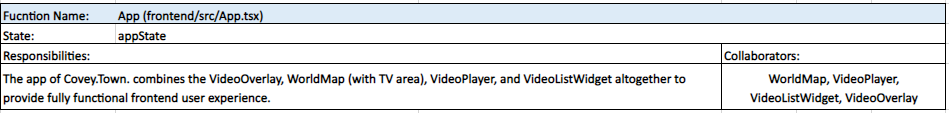
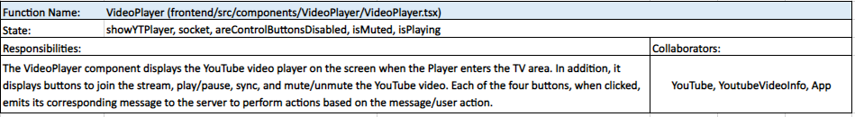
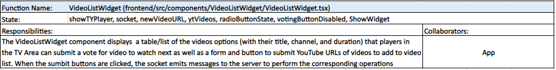
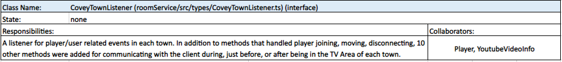
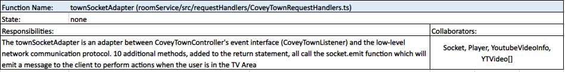
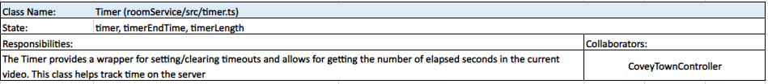
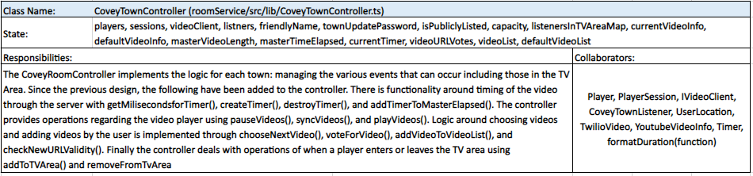

# Architecture Overview 

Our synchronous video player feature has a few major parts: an interactive video player component on the frontend, a reactive widget on the frontend for voting on the next video to play, and the modified controller on the backend to handle maintaining video synchronicity, voting, and URL validation. The video player (VideoPlayer.tsx) and voting widget (VideoListWidget.tsx) are both React components. The video player utilizes a npm package called react-youtube, which is a wrapper for the IFrame Youtube Player API, to implement a reactive youtube player. Both the video player and the voting widget utilize Chakra UI for styled components. The backend utilizes the Youtube Data API to validate URLs submitted by users on the client-side. The general flow of the feature is that the location of the user on the map (as determined in App.tsx) causes the two React components to be rendered on screen or not, and the server communicates back and forth with the two components through a socket to establish video synchronicity and update voting options.  

## Frontend: 

The two components (VideoPlayer and VideoListWidget) are visually placed below the world map and the Twilio video feed. They were placed here instead of to the right of the map so that the video player would show up right under the Twilio video feed so that users could talk about the video while watching and also be able to interact with the voting widget. The App function in App.tsx was modified to include these two components under the WorldMap and VideoOverlay components. The map has three additions (the first two additions required changes to tuxemon-town.json): 1) A TV icon was added north of where the player spawns, 2) A label for the “TV Area” was placed in the middle of the area that a user can join the synchronous stream from, and 3) A helpful hint to “Walk into TV Area to watch videos” was added at the top left of the screen with a small code change in WorldMap.tsx. 

### VideoPlayer: 

The video player is only rendered when the user walks into the TV Area. App.tsx was modified so that when the user enters the area, a boolean controlling the rendering called showYTPlayer (which has been added to the CoveyAppState) is set to true. The App.tsx keeps the state of the showTYPlayer based on the user location. Note: Both the video player and voting widget components use the useCoveyAppState hook to gain access to showYTPlayer and the socket. Once rendered, the youtube player will have a transparent 
 box on top of it which forces the user to interact with the youtube player exclusively through Chakra UI buttons since the youtube player cannot be clicked. Once rendered, the only button initially displayed is a “Join Stream” button, which upon being clicked, will emit a message through the socket to the server to add the user and their associated listener into a hashmap of users in the TV area, and the three buttons for controlling the youtube player will appear and be enabled on the screen. The voting widget, discussed in the next paragraph, will also be rendered after the user clicks “Join Stream”. The first Chakra UI button “Play/Pause” emits a message to the server to either play or pause every client’s video at the same time to maintain synchronicity. Similarly, the second button “Sync” emits a message to the server to have every client’s video load up from the same timestamp (this is useful in case buffering causes videos to go out of sync). Upon first rendering, the video player uses the useEffect hook to set up socket event handlers that receive these incoming messages about pausing/playing/syncing and have the youtube player object call the relevant methods. The third button “Mute/Unmute”, on the other hand, does not interact with sockets or the server since clicking it directly calls the mute or unmute method on the youtube player object. 

### VideoListWidget: 

As mentioned above, the voting widget (VideoListWidget) renders once the user clicks “Join Stream”. This is because its rendering is dependent on the aforementioned showYTPlayer boolean as well as the showWidget boolean that is kept in state in the VideoListWidget and set to true once the server receives the socket message from the video player that the client has joined the stream and subsequently emits a message back to the client to set showWidget to true. Once the client joins the stream, the server also uses the socket to send the list of videos (URL, Title, Channel, and Duration) to the client to automatically render the video options in a table with a radio button next to each entry for voting. The video options are saved in state and updated if a new video is added to vote on. Checking the radio button next to a video entry will set the radioButtonState variable to have the associated video URL. Clicking the “Submit Vote” button will emit a message to the server that a vote was cast for the URL kept in radioButtonState. Casting a vote will cause the voting button to be disabled until the current video ends and the server tells every client in the TV area to load up the next video and to re-enable their voting buttons. The bottom section of the voting widget has an input box and button for submitting new Youtube URLs that the user would like to have added to everyone’s list of videos to vote on. The next section describing the details of the backend explains how video URLs are validated. On the frontend, a valid URL submission results in a Toast indicating to everyone that a video has been added to their table to vote on. An invalid URL submission results in an informative Toast being displayed for just the submitter.  

Finally, App.tsx was modified so that walking away from the TV Area 1) sets showYTPlayer to false causing both the video player component and voting widget component to disappear from screen and 2) emits a message to the server that this client has left the area. 

## Backend: 

The most prominent additions to the backend were made in modifying the CoveyTownController. Modifications were also made to the CoveyTownListener interface to have methods for communicating with clients during, just before, or just after being in the TV Area. CoveyTownRequestHandlers was modified so that townSubscriptionHandler would set up the socket to receive messages from clients and call the appropriate CoveyTownController methods related to the video feature. The townSocketAdapter was also modified to listen for events relevant to users in the TV Area and emit messages through the socket to the client to appropriately update their components. A Timer class (timer.ts) was added so that the controller would have a tool for setting timeouts that would choose the next video to play after the video completed. The timer class allowed for getting the number of seconds elapsed in the current video as well. A YTVideo.ts file was also added to keep track of the default videos that the server gives to a client who was the first user to join the video stream to display in their voting widget. Inside of this file is the YTVideo type that has a url, title, channel, and duration, which is used to represent a video. CoveyTypes.ts also includes a new type YoutubeVideoInfo that has a url, timestamp, and isPlaying boolean which is used to represent the current state of the video playing or to be played. 

### CoveyTownController: 

The major addition to the controller is the use of a map data structure to store players/listeners within the TV Area in Covey Town. We implemented this change to allow us to communicate messages to each client from the server. This is important in our implementation of synchronous video as each client must be notified when changes occur. For example, when a client on the frontend clicks the play/pause or sync button, we must be able to notify other clients in the TV Area to also perform the same action, thus remaining synchronous. When a client enters the TV Area, a message is emitted to the server through the socket so that the server can add the player/listener to its map as well as send the current video/timestamp and list of videos to vote on to the user. When a client leaves the TV Area, the controller is also alerted and it removes the player/listener from the map and sends messages through the socket to the client to reset their state to prepare for the next time they enter the TV Area. 

Another design choice we made was to track time on the server through a master time elapsed property. There are four major components that make our time work. First, the master time elapsed will be responsible for dictating how much time has elapsed in the current video. Second, we will make use of a timer, which is a class we designed to allow us to track time on the server and calculate the seconds elapsed since the timer was created (corresponding to when the video started). Third, a timer is created when one of two scenarios is met: 1) The first player joins the stream on the frontend. 2) Any player hits the play button on the frontend. Fourth, the timer is only ever destroyed when a client pauses the video (since time should not be counting down until the video ends) thus, we only update master time elapsed when this occurs. In any other scenario when an existing player or new player needs the current master time elapsed, we will provide the sum of the elapsed seconds of the current timer and the master time elapsed.  

The server maintains a map of video URLs to the number of votes that have been cast for each URL. This list is updated every time a client casts a vote for a URL and the socket receives the URL and submits it to the controller. When the timer runs out for the current video, a method in the controller is called which iterates through the map and finds the URL with the most votes. The controller then has each listener in the TV Area tell their respective client to load that URL and play the video. The controller also creates a new blank map of URLs to votes when the next video is chosen to ensure that all votes cast only affect the next video chosen. Users can also submit their own URL to be added to everyone’s voting widget in the TV Area. When the user submits a URL on the frontend, it is sent to the server through the socket and the controller makes a call to the Youtube Data API to validate the URL. If it is valid then the controller will add the information about the new video to its master list of videos for this session and have the listeners send the updated info to the users to add to their widgets. If the URL is invalid, the controller will notify only the submitting user that their proposed URL was invalid. An environment key was added so that the server is authorized to make calls to the Youtube Data API. 

